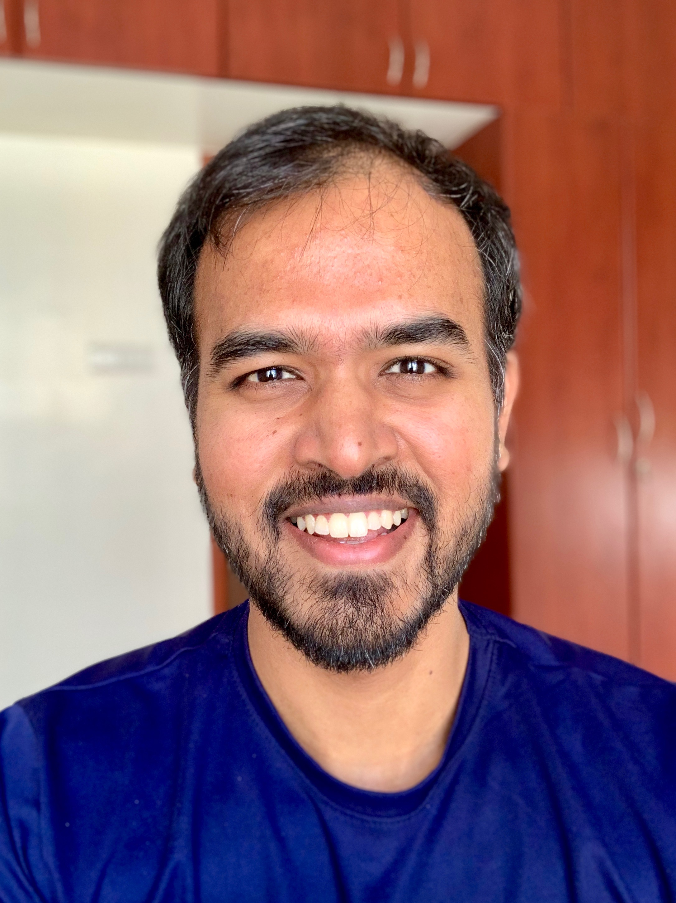

 I am
an Assistant Professor in the [Computer Science and
Engineering](http://cse.iitm.ac.in/) department at [Indian Institute of
Technology, Madras](https://www.iitm.ac.in/) and the Chief Technology Officer of
[Tarides](https://tarides.com/). I am interested in building robust, secure and
scalable systems using programming language technology.

I led the development of [Multicore
OCaml](https://github.com/ocamllabs/ocaml-multicore), a concurrent and parallel
extension of the OCaml programming language. Multicore OCaml is now
[merged](https://github.com/ocaml/ocaml/pull/10831) into OCaml, and is available
for general use in OCaml 5.0. Effect handlers introduced as part of the
concurrency story of Multicore OCaml has had influence on the design of [React
Hooks](https://legacy.reactjs.org/docs/hooks-faq.html#what-is-the-prior-art-for-hooks)
and [WebAssembly stack switching](https://dl.acm.org/doi/pdf/10.1145/3622814).

I've co-founded several companies

* [Tarides - France](https://tarides.com/)
* [OCaml Labs Consultancy - UK](http://ocamllabs.io/) _(joined Tarides)_
* [Segfault Systems - India](https://segfault.systems) _(joined Tarides)_

to build systems that are _functional_, and functional programming in
[OCaml](https://ocaml.org/) turns out to be a fine choice for this.

Earlier, I was a Senior Research Associate under the [OCaml
Labs](http://www.cl.cam.ac.uk/projects/ocamllabs/) initiative at the [University
of Cambridge](http://www.cam.ac.uk/) [Computer Lab](http://www.cl.cam.ac.uk/),
an [1851 Research Fellow](http://www.royalcommission1851.org/awards/) and a
Research Fellow at [Darwin College, Cambridge](https://www.darwin.cam.ac.uk/).
Earlier, I was a [graduate student](https://www.cs.purdue.edu/homes/chandras/)
at [Purdue University](http://www.purdue.edu/) where I obtained an MS and a PhD
degree in Computer Science under the supervision of the wonderful [Prof. Suresh
Jagannathan](https://www.cs.purdue.edu/homes/suresh/). Before that, I obtained
my BEng degree in Computer Science and Engineering from [Anna University,
India](https://www.annauniv.edu/).

I write about my research in my [blog](http://kcsrk.info/blog/)
(though not as often as I would like to).

 * [CV](cv/cv.pdf)
 * [Research Statement](research/research.pdf)
 * [Publications](publications.html)

# Latest News

<a class="twitter-timeline" href="https://twitter.com/kc_srk?ref_src=twsrc%5Etfw">Tweets by kc_srk</a> 

# Activities

* **DEI Co-Chair:** ICFP 2025.
* **Associate Editor:** [OOPSLA 2025](https://2025.splashcon.org/track/OOPSLA).
* **Streeing committee member**:
  + ICFP, Member at Large, serving 9/2023 -- 9/2027
  + [Principles and Practice of Consistency for Distributed Data (PaPoC)](https://papoc-workshop.github.io/2025/committees.html)
  + [ML workshop](https://www.mlworkshop.org/steering-committee), 2019 -- 2022
* **Editor** -- [JFP Special Issue on Effect Handlers](https://www.cambridge.org/core/journals/journal-of-functional-programming/collections/effects-and-handlers)
* **Organizer**
  + [First OCaml Retreat at Auroville](https://ocamlretreat.org/), 2024
  + [Shonan meeting on "Programming Language support for Data-intensive Systems"](https://shonan.nii.ac.jp/seminars/143/), 2019
  + [Dagstuhl meeting on "Effect Handlers go Mainstream!"](https://www.dagstuhl.de/en/program/calendar/semhp/?semnr=18172), 2018
* **PC Chair** -- [PROPL'25](https://conf.researchr.org/home/icfp-splash-2025/propl-2025), PaPoC'22, ML'19
* **AEC Chair** -- ESOP'22
* **PC member**
  + 2025: [FunArch'25](https://conf.researchr.org/home/icfp-splash-2025/funarch-2025), [ICFP'25](https://icfp25.sigplan.org/), [PaPoC'25](https://papoc-workshop.github.io/2025/), [APLAS'25](https://conf.researchr.org/home/aplas-2025)
  + 2024: OOPSLA'24, PaPoC'24, POPL'24, TFP'24, PEPM'24
  + 2023: PLDI'23
  + 2022: OCaml'22, ML'22, PEPM'22, PLDI'22
  + 2021: GPCE'21, TyDe'21, PaPoC'21, PADL'21
  + 2020: ICFP'20, PaPoC'20
  + 2019: OCaml'19
  + 2017: PMLDC'17, OBT'17
  + 2016: OCaml'16
  + 2013: Splash-MARC symposium '13.
* **Expert Reviewer**
  + 2023: POPL'23, PPoPP'23
* **ERC member** -- ICFP'19
* **AEC member** -- ICFP'18, PPoPP/CGO'16, PLDI'15
* **Invited meetings**
  + [Guest, WG 2.8, Maine](https://ifip-wg28.github.io/43-maine-2025/minutes.html), 2025
  + [Dagstuhl meeting on "Utilising and Scaling the WebAssembly Semantics"](https://www.dagstuhl.de/seminars/seminar-calendar/seminar-details/25241), 2025
  + Observer, WG 2.1, Canberra, 2024 (Declined due to personal reasons)
  + [Guest, WG 2.8, Utrecht](https://ifip-wg28.github.io/42-utrecht-2024/minutes.html), 2024
  + [Dagstuhl meeting on "Foundation of WebAssembly"](https://www.dagstuhl.de/en/seminars/seminar-calendar/seminar-details/23101), 2023
  + [Dagstuhl meeting on "Scalable handling of effects"](https://www.dagstuhl.de/en/seminars/seminar-calendar/seminar-details/21292), 2021
  + [Dagstuhl meeting on "From Theory to Practice of Algebraic Effects and Handlers"](https://www.dagstuhl.de/en/seminars/seminar-calendar/seminar-details/16112), 2016

# Contact

 * Email : kcsrk@cse.iitm.ac.in (used for academic work), kc@tarides.com, kc@kcsrk.info
 * IRL : [SSB 413, IIT Madras](https://maps.app.goo.gl/42Wq2Cy5UQLkkDRo6)
 * Twitter : <a href="https://twitter.com/kc_srk"> @kc_srk </a> (aiming to use less of this in favour of ↓)
 * Bluesky : <a href="https://bsky.app/profile/kcsrk.info"> @kcsrk.info </a>
 * Github : <a href="https://github.com/kayceesrk"> kayceesrk </a>
 * BitBucket : <a href="https://bitbucket.org/kayceesrk"> kayceesrk </a>

 
