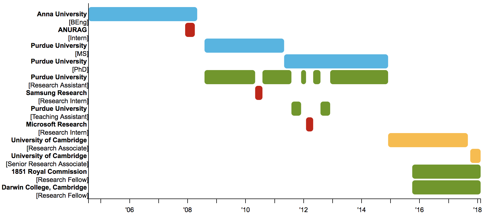

 I am a
Post-doctoral Research Associate under the [OCaml
Labs](http://www.cl.cam.ac.uk/projects/ocamllabs/) initiative at the
[University of Cambridge](http://www.cam.ac.uk/) [Computer
Lab](http://www.cl.cam.ac.uk/), an [1851 Research
Fellow](http://www.royalcommission1851.org/awards/) and a Research Fellow at
[Darwin College, Cambridge](https://www.darwin.cam.ac.uk/). I am also a member
of the [Network and Operating
Systems](http://www.cl.cam.ac.uk/research/srg/netos/) group.

I am interested in the design and implementation of concurrent functional
programming languages targeting scalable platforms such as many-core processors
and compute clouds. My research spans programming models, compilers, static
analysis, schedulers, threading systems, and memory management.

Before coming to Cambridge, I was a [graduate
student](https://www.cs.purdue.edu/homes/chandras/) at [Purdue
University](http://www.purdue.edu/) where I obtained an MS and a PhD degree in
Computer Science under the supervision of the wonderful [Prof. Suresh
Jagannathan](https://www.cs.purdue.edu/homes/suresh/). At Purdue, I led the
[MultiMLton](http://multimlton.cs.purdue.edu/) and
[Quelea](http://kcsrk.info/Quelea/) projects. Before that, I obtained my BEng
degree in Computer Science and Engineering from [Anna University,
India](https://www.annauniv.edu/).

 * [CV](cv/cv.pdf)
 * [Research Statement](research/research.pdf)

# Contact

 * Email : `(\i -> i ++ "@cl.cam.ac.uk") "sk826"`
 * IRL : 15 JJ Thomson Ave, Cambridge CB3 0FD
 * Twitter : <a href="https://twitter.com/kc_srk"> @kc_srk </a>
 * Github : <a href="https://github.com/kayceesrk"> kayceesrk </a>
 * BitBucket : <a href="https://bitbucket.org/kayceesrk"> kayceesrk </a>

# Timeline

# Publications

## Overview

 * Distributed Programming : [PLDI15](#pldi15) | [PADL14](#padl14) | [ML13](#ml13)
 * Concurrent Programming : [OCaml15](#ocaml15) | [PLDI11](#pldi11) | [ICFP09](#icfp09) | [JFP16](#jfp16) | [ML10](#ml10) | [TR11](#tr11) | [DAMP10](#damp10)
 * Multicore Runtime : [JFP14](#jfp14) | [MARC12](#marc12) | [ISMM12](#ismm12) | [SFMA11](#sfma11)
 * Session Types : [SCP13](#scp13) | [COORDINATION10](#coordination10)

## PhD Dissertation

 * 
 KC Sivaramakrishnan

 [Functional Programming Abstractions for Weakly Consistent Systems](papers/dissertation_dec14.pdf) </a> 

 *Department of Computer Science, Purdue University, Dec 2014* 

 [\[slides (pdf)\]](slides/defense.pdf) [\[slides (pptx)\]](slides/defense.pptx) [\[bib\]](bib/phd.txt) 

## Journal publications

 1. 
 KC Sivaramakrishnan, Tim Harris, Simon Marlow, Simon Peyton Jones

 [Composable Scheduler Activations for Haskell](papers/schedact_jfp16.pdf) </a> 

 *Journal of Functional Programming (JFP), 2016* 

 [\[code\]](https://github.com/ghc/ghc/tree/ghc-lwc2) 

   

 2. 
 KC Sivaramakrishnan, Gowtham Kaki, Suresh Jagannathan

 [Representation without Taxation: A Uniform, Low-Overhead, and High-Level
Interface to Eventually Consistent Key-Value Stores](papers/quelea_ieee16.pdf) </a> 

 *IEEE Data Engineering Bulletin, 39(1): 52 – 64, March 2016* 

  **Invited Paper** [\[bib\]](bib/ieee16.txt) 

   

 3. 
 KC Sivaramakrishnan, Lukasz Ziarek, Suresh Jagannathan

 [MultiMLton: A Multicore-aware Runtime for Standard ML](papers/multimlton_jfp14.pdf) </a> 

 *Journal of Functional Programming (JFP), 24(6): 613 – 674, 2014* 

 [\[code\]](https://github.com/kayceesrk/multiMLton) [\[bib\]](bib/jfp14.txt) 

   

 4. 
 KC Sivaramakrishnan, Mohammad Qudeisat, Lukasz Ziarek, Karthik Nagaraj, Patrick Eugster

 [Efficient Sessions](papers/sting_scp13.pdf) </a> 

 *Science of Computer Programming (SCP), 78(2): 147 – 167, 2013* 

  **Invited Paper** [\[code\]](https://github.com/kayceesrk/Sting) [\[bib\]](bib/scp13.txt) 

## Conference publications

 1. 
 KC Sivaramakrishnan, Gowtham Kaki, Suresh Jagannathan

 [Declarative Programming over Eventually Consistent Data Stores](papers/quelea_pldi15.pdf) 

 *International Conference on Programming Language Design and Implementation (PLDI), 2015* 

 [\[code\]](http://kcsrk.info/Quelea) [\[techrep\]](papers/quelea-long.pdf) [\[bib\]](bib/pldi15.txt) 

   

 2. 
 KC Sivaramakrishnan, Lukasz Ziarek, Suresh Jagannathan

 [Rx-CML: A Prescription for Safely Relaxing Synchrony](papers/rxcml_padl14.pdf) </a> 

 *Symposium on Practical Aspects of Declarative Languages (PADL), 2014* 

 [\[code\]](https://github.com/kayceesrk/mlton-zmq) [\[slides (pdf)\]](slides/padl14.pdf) [\[slides (key)\]](slides/padl14.key) [\[bib\]](bib/padl14.txt) 

   

 3. 
 KC Sivaramakrishnan, Lukasz Ziarek, Suresh Jagannathan

 [A Coherent and Managed Runtime for ML on the SCC](papers/mmscc_marc12.pdf) </a> 

 *Many-core Architecture Research Community Symposium (MARC), 2012* 

 **Best Paper Award** [\[code\]](https://github.com/kayceesrk/multiMLton/tree/split-heap-parallel-GC-IntelSCC) [\[slides (pdf)\]](slides/marc12.pdf) [\[slides (pptx)\]](slides/marc12.pptx) [\[bib\]](bib/marc12.txt) 

   

 4. 
 KC Sivaramakrishnan, Lukasz Ziarek, Suresh Jagannathan

 [Eliminating Read Barriers through Procrastination and Cleanliness](papers/mmgc_ismm12.pdf) </a> 

 *International Symposium on Memory Management (ISMM), 2012* 

 [\[slides (pdf)\]](slides/ismm12.pdf) [\[slides (pptx)\]](slides/ismm12.pptx) [\[bib\]](bib/ismm12.txt) 

   

 5. 
 Lukasz Ziarek, KC Sivaramakrishnan, Suresh Jagannathan

 [Composable Asynchronous Events](papers/acml_pldi11.pdf) </a> 

 *International Conference on Programming Language Design and Implementation (PLDI), 2011* 

 [\[bib\]](bib/pldi11.txt) 

   

 6. 
 KC Sivaramakrishnan, Karthik Nagaraj, Lukasz Ziarek, Patrick Eugster

 [Efficient Session Type Guided Distributed Interaction](papers/sting_coordination10.pdf) </a> 

 *International Conference on Coordination Models and Languages (COORDINATION), 2010* 

 [\[code\]](https://github.com/kayceesrk/Sting) [\[slides (pdf)\]](slides/coordination10.pdf) [\[slides (key)\]](slides/coordination10.key) [\[bib\]](bib/coordination10.txt) 

   

 7. 
 Lukasz Ziarek, KC Sivaramakrishnan, Suresh Jagannathan

 [Partial Memoization of Concurrency and Communication](papers/memo_icfp09.pdf) </a> 

 *International Conference on Functional Programming (ICFP), 2009* 

 [\[bib\]](bib/icfp09.txt) 

## Workshop publications

 1. 
 Stephen Dolan, Leo White, KC Sivaramakrishnan, Jeremy Yallop and Anil Madhavapeddy

 [Effective Concurrency with Algebraic Effects](papers/effects_ocaml15.pdf) </a> 

 *OCaml Worshop, 2015* 

 [\[code\]](https://github.com/kayceesrk/ocaml-eff-example) [\[slides (pdf)\]](slides/OCaml15.pdf) [\[slides (key)\]](slides/OCaml15.key) 

   

 2. 
 KC Sivaramakrishnan, Lukasz Ziarek, Suresh Jagannathan

 [Migrating MultiMLton to the Cloud](papers/mmcloud_mlw13.pdf) </a> 

 *ML Worshop, 2013* 

   

 3. 
 Daniel G. Waddington, Chen Tian, KC Sivaramakrishnan

 [Scalable Lightweight Task Management Schemes for MIMD Processors](papers/snapple_sfma11.pdf) </a> 

 *Workshop on Systems for Future Multi-Core Architectures (SFMA), 2011* 

 [\[bib\]](bib/sfma11.txt) 

   

 4. 
 Suresh Jagannathan, Armand Navabi, KC Sivaramakrishnan, Lukasz Ziarek

 [Design Rationale for MultiMLton](papers/multimlton_mlw10.pdf) </a> 

 *ML Workshop, 2010* 

 [\[bib\]](bib/mlw10.txt) 

   

 5. 
 KC Sivaramakrishnan, Lukasz Ziarek, Raghavendra Prasad, Suresh Jagannathan

 [Lightweight Asynchrony using Parasitic Threads](papers/parasites_damp10.pdf) </a> 

 *Workshop on Declarative Aspects of Multicore Programming (DAMP), 2010* 

 [\[bib\]](bib/damp10.txt) 

## Technical Reports and Drafts

 1. 
 KC Sivaramakrishnan, Lukasz Ziarek, Suresh Jagannathan

 [Featherweight Threads for Communication](papers/parasites_tech11.pdf) </a> 

 *Purdue University Computer Science Technical Report – TR-11-018, 2011* 

 [\[bib\]](bib/featherweight.txt) 

# Talks

 * **Concurrent and Multicore OCaml: A deep dive**

 Facebook, Menlo Park, CA, Jan 2016 

 [\[slides (pdf)\]](slides/multicore_fb16.pdf) [\[slides (key)\]](slides/multicore_fb16.key) 

 * **Effective Concurrency with Algebraic Effects**

 OCaml Workshop, Sep 2015 

 * **Functional Programming Abstractions for Weakly Consistent Systems**

 Purdue University, Dec 2014 

 * **Functional Abstractions for Practical and Scalable Concurrent Programming**

 Microsoft Research, Cambridge, UK, Mar 2014 

 [\[slides (pdf)\]](slides/msr14.pdf) [\[slides (pptx)\]](slides/msr14.pptx) 

 * **Rx-CML: A Prescription for Safely Relaxing Synchrony**

 PADL '14, Jan 2014

 * **Migrating MultiMLton to the Cloud**

 ML Workshop '13, Sep 2013 

 * **A Coherent and Managed Runtime for ML on the SCC**

 MARC '12, Nov 2012 

 * **Eliminating Read Barriers through Procrastination and Cleanliness**

 &dagger; &nbsp; ISMM '12, Jun 2012 

 &dagger; &nbsp; Wrestling Wednesdays, Microsoft Research, Cambridge, May 2012 

 * **Lightweight Concurrency in GHC**

 Microsoft Research, Cambridge, May 2012 

 [\[slides (pdf)\]](slides/ghclwc.pdf) [\[slides (pptx)\]](slides/ghclwc.pptx) 

 * **Efficient Session Type guided Distributed Interaction**

 COORDINATION '12, Jun 2012 

